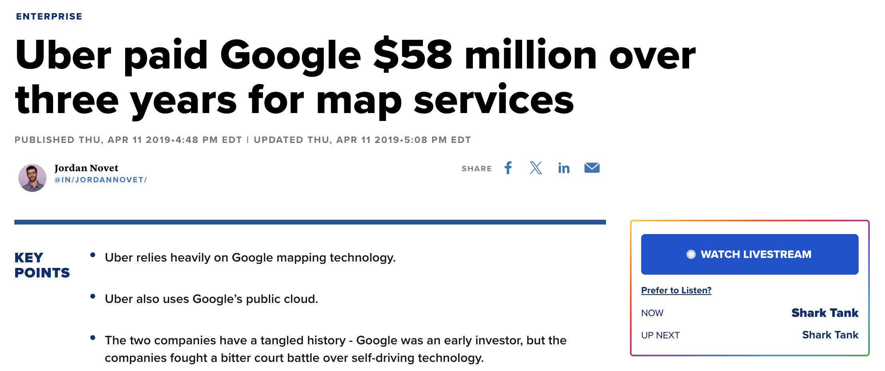

::: callout-tip
## Learning Goals {.unnumbered}

By the end of this lecture, you should be able to:

-   Distinguish structured, semi-structured, and unstructured data
-   Explain intuitively the differences between user interface and application program interface (API)
-   List the advantages of APIs as a means to collect data and apply use APIs to acquire data

:::

## The Business Challenge

Data is often called the “new oil” of the digital economy. Yet, just as not all oil flows neatly through pipelines, not all data comes in ready-to-use formats. Some data is nicely organized in databases, spreadsheets, or CSV files, while other data appears in messy, irregular, or unconventional formats.

So far in this subject, we have mainly worked with structured data. In practice, however, such well-organized data is something of a luxury. It is costly to collect, standardize, and store, and organizations often invest heavily in information systems just to maintain it. At the same time, vast amounts of potentially valuable data exist outside these traditional formats.

In this chapter, we will explore structured, semi-structured, and unstructured data. You will learn the defining characteristics of each category, why they matter for business analytics, and how analysts can collect and make use of data from different sources.

## Structured, Semi-structured, and Unstructured Data

Just as crude oil must be refined before it becomes useful, raw data only generates value when it can be systematically collected, processed, and analyzed. Depending on how well-defined its format is, data is typically classified into three broad categories:

-   Structured data
-   Unstructured data
-   Semi-structured data

### Structured Data {.unnumbered}

**Structured data**, as the name suggests, refers to highly organized data that follows a predefined schema. It is stored in formats such as relational databases, spreadsheets, and CSV files, where every piece of data is clearly defined and fits into a particular row and column. Most data that we have worked with so far in this subject belongs to this category.

A well-defined structure for data often consists of:

-   Rows (Records, Observations): Each row corresponds to one unique instance of the entity being described (e.g., a single customer, a single sales transaction).

-   Columns (Fields, Variables): Columns represent attributes or characteristics of the entity (e.g., customer age, transaction amount).

-   Tables: Data is organized into tables that can be linked to each other through shared variables or keys (e.g., linking different customer data using customer ID).

Because of their consistency, structured datasets can be easily managed and analyzed with tools like SQL, R’s Tidyverse, or Python’s Pandas. These tools allow us to perform operations easily on structured data by doing filtering, grouping, aggregating, merging, and reshaping data efficiently. 

::: callout-note
## Examples

-   Banking transaction records (date, amount, sender, recipient)

-   Inventory databases (product ID, stock quantity, unit price)

-   Employee HR records (employee ID, salary, department)
:::

Structured data’s strength lies in its precision and reliability. However, it is also limited in scope and volume. Many real-world data and information, such as consumer opinions, video content, or machine logs, cannot be easily captured in neat rows and columns.

### Unstructured Data {.unnumbered}

In reality, structured data represents only a small fraction of all data. As predicted by International Data Corporation (IDC) and Seagate, the global data endowment will continue growing exponentially and reach 163 zettabytes (i.e., 1 trillion gigabytes) by the end of 2025, and among all data, more than 80% is unstructured.

**Unstructured data**, in stark contrast to structured data, lacks a fixed or consistent schema. It is generated in diverse formats and is often messy, irregular, or context-dependent. Broadly speaking, all information that we generate, unless it comes with predefined structures, belongs to unstructured data. Unlike structured data, it cannot be easily represented in tables of rows and columns.

::: callout-note
## Examples

-   Textual data: emails, chat messages, social media posts, product reviews.
-   Multimedia data: images, audios, videos, surveillance cameras recordings, readings/images from medical devices.
:::

Unstructured data is pervasive because much of the information we generate in daily life does not naturally follow a rigid, tabular structure. It posits significant challenges in collecting and processing data:

-   Lack of standardization.
    -   Unstructured data is in very different categories. Even within the same category, unstructured data may be recorded in different formats.
    -   Computers and programs cannot easily tackle data without standardized formats and patterns,
-   Volume and variety
    -   The scale of unstructured data is massive: billions of social media posts per day, countless images and videos uploaded online, etc.
    -   The variety of formats requires specialized tools for each type (e.g., natural language processing for text, computer vision for images).
-   Collection challenges
    -   Unstructured data is often dispersed across platforms and devices. Collecting it may involve:
        -   Massive manual work (i.e., human labelling of data, CAPTCHA)
        -   Web scraping (can be technically challenging and sometimes legally restricted)
        -   Large storage infrastructures (extremly costly)
-   Processing requirements
    -   Before analysis, unstructured data usually must undergo heavy preprocessing and transformation (e.g., machine learning algorithms and AI):
        -   Text: tokenization, stop-word removal, stemming, sentiment analysis (note that Google BERT and GPT have largely facilitated the processing of texts and natural language)
        -   Images: resizing, labeling, feature extraction
        -   Audio: noise reduction, speech-to-text transcription

### Semi-Structured Data {.unnumbered}

Between these two extremes is **semi-structured data**. Different from structured data, semi-structured data does not fit neatly into tables, but it still carries markers or tags that provide some structure. Compared with purely unstructured data, semi-structured data has a flexible but interpretable format.

::: callout-note
## Examples

-   JSON file (as we discussed in the previous week).
-   HTML documents: HTML tags (`<div>`, `<h1>`, `<p>`) give structures, but the actual text and images inside the tags are unstructured.
-   Emails: contain structured fields (sender, recipient, timestamp, subject) but also unstructured free-form text in the body.
-   Chat logs: often include metadata (user ID, time) plus free text content.
:::

::: {.callout-tip title="Summary" collapse="true"}
-   Structured data is easy to store, query, and analyze, but costly to maintain and often limited in scope.

-   Unstructured data is abundant and rich but difficult to process without specialized tools.

-   Semi-structured data sits in the middle: it provides some structure but still requires significant preprocessing before analysis.
:::

::: callout-tip
## Remark
For structured data, we have databases to manage them and apply to them relatively standardized data wrangling tools (e.g., `dplyr`). However, we do not have such luxury for less structured data. The ways of collecting and using less structured data usually vary across different cases. Do not be panic if the methods that we use in our examples do not work in a different case. What matters to us is to get familiar with the workflow.
:::

## Getting Data Using Application Program Interface (API)

In library, we may not always be able to go and look for the books directly - especially when some books may be stored in the staff-only area or difficult to find. In such cases, we can submit requests to a librarian, and the librarian gets the books for us from the shelves.

This process is a nice analogy to what happens when we acquire data via application program interface (API):

-   You are a data user
-   The librarian is the API
-   The staff-only area is the internal system or database you don't have access to
-   The request for a book is the message your program sends to the API
-   The book the librarian brings back is the data or service the API provides

### Definitions of API {.unnumbered}

Technically speaking, **Application program interface (API)** builds a "connection" between computer and computer programs and specifies a standard set of rules or procedures that an application program will do. This is in contrast to **user interfaces (UI)** where users directly interact with computers or programs.

::: callout-note
## Example: Uber's Usage of Google Map API

We use web-based Google Map or Google Map App to search for locations and navigate to places we want to go. In such scenarios, we, as human users, are directly interact with the user interface (UI) of Google Map to acquire data and information.

As a giant in ride-share and door-to-door delivery services, Uber uses Google Map to obtain data and information that they need for their apps (e.g., map, address information, routes, estimated time of arrival, etc.). In contrast to our usage of Google Map, Uber gets access to Google Map data by using programs to interact with Google Map's application program interface (API). This allows Uber to get real-time data from Google Map and use such data in real time. We cannot imagine Uber would be able to kick start its business without the Google Map API.

Of course, the access to Google Map via API is not free. Uber pays millions to Google in order to use their services.


:::

### Advantages of APIs {.unnumbered}

Nowadays, many data providers set up APIs as a preferred way to provide data to data users, and there are several advantages of doing so:

-   **Controlled Access.** APIs allow data providers to share only selected data or functions, rather than giving users full access to internal systems and data servers. This helps protect sensitive data and system integrity.
-   **Standardization.** By providing a standardized way to access data, APIs reduce the need to handle custom requests or build separate solutions for each user, thus reducing the costs.
-   **Innovation and Ecosystem Growth.** APIs allow third-party developers to build new apps or services that enhance the value of data (e.g., Google Maps used in ride-sharing apps).
-   **Usage Tracking and Monetization.** APIs make it easy to monitor who is using the data and how often. This opens up possibilities for charging based on usage or offering premium tiers.

### Workflow of Using APIs to Acquire Data {.unnumbered}

Most APIs are user-friendly because the rules and protocols of data acquisition have already been set up by data providers. Although every API may differ significantly from the other in many ways. Standard workflow still applies to the usage of APIs.

We are going to use the "Music to Scrape" website (https://music-to-scrape.org/) to walk through the usage of APIs.

#### Read User Manuals {.unnumbered}

APIs are structured differently for different functions and needs. In practice, every API may have its own predefined functions and specific requirements for inputs and outputs. Therefore, it is rather important to carefully read through API user manuals before starting using it. Additionally, data providers often provide detailed user manuals and sample program for their APIs. As a user, it would be useful to go through these materials (if available).

#### Obtaining API Key {.unnumbered}

In many cases, the access to APIs is limited - you need to get an **API key** so that you can use the API. We can think API key as the log-in credentials for programs. Data providers can use API keys to track the download and the usage of data and prevent unwarranted access to their data.

For the simple website we are working on, there is no need to obtain an API key. In the workshop, we are going to apply for a free API key from the **Federal Reserve Economic Data (FRED)**.


#### Using APIs {.unnumbered}

## Setup

Every day we interact with systems that exchange data automatically: Spotify, banking apps, weather services, maps, financial platforms, and AI systems.

Most of these systems communicate through APIs. Websites are usually designed for humans who want to gather information; APIs are designed for software systems that gather information. In other words, APIs are standardized machine interfaces for structured data exchange.

APIs usually return structured transport data, not analysis-ready tables. After we have called an API, we need to do the following to the response we receive:

 - parse it as a JSON response;
 - nest it as an R list;
 - rectangle it as an R table;
 - clean it as a tidy table;
 - store it as a database table.

Before we start working with today's API, we need to get set up:

```{r}
library(httr)
library(jsonlite)
library(tidyverse)

api_url <- "https://api.music-to-scrape.org"
```

`httr` helps us communicate with APIs.

We store our base URL as an object because we will repeatedly point our API to it, plus some extension depending on the specific data we are after.

## Request weekly top tracks

Let's actually ask a server for some data. To do so, we make an API request:

```{r}
response <-
  GET(
    url = paste0(api_url, "/charts/top-tracks"),
    query = list(
      unixtimestamp = as.integer(as.POSIXct("2026-05-01", tz = "UTC")),
      limit = 5
    )
  )
```

As you see, this is a programmatic approach, which is fundamentally different from, for example, downloading and reading in a CSV.

Let's unpack our request - it has a clear structure:

 - We are sending a GET request: "Please send some data."
 - The URL identifies the endpoint: "Get the data from here."
 - The parameters refine the request: "Get these bits of the data."
 - The request generates a response, which we store as an object.

The response is an object - but not one we have seen before.

So, what is this response we get back? Let's inspect it:

```{r}
status_code(response)
```

Servers communicate back whether requests succeed or fail. Code `200` is good; codes such as `404` or `500` are bad.

What is the format of our successful response?

```{r}
http_type(response)
```

We get back a structured format that we are now familiar with, JSON.

And, what does this response contain?

```{r}
headers(response)
```

We get more than the data we are after - we also get metadata, which is information about our request and the data it returns (i.e., information on  the server, content type, encoding, etc).

The following may be a helpful way to think about APIs: the response object is like an envelope, while the body is the letter inside. The metadata are information written on the envelope.

But we don't yet have a dataset - we have a response object from the server that we need to operate on.

## Inspect the JSON response

We need to first extract the body of this response as text - i.e., the JSON text that contains the music data. For our purposes, we can leave the rest behind because we don't need the metadata, headers, status code, etc.

```{r}
json_text <-
  content(
    response,
    as = "text",
    encoding = "UTF-8"
  )
```

Let's now inspect the structure text to ensure we have raw JSON:

```{r}
substr(json_text, 1, 500)
```

This is just like the JSON file we used last week: braces, brackets, keys, values, and nesting. The main difference is that our text is reading from left to right, rather than top to bottom.

But this is not yet a table that we can analyse. We ultimately need to move from this hierarchical structure to a rectangular one.

So, first we must manually parse the JSON:

```{r}
top_tracks_list <-
  fromJSON(
    json_text,
    simplifyVector = FALSE
  )
```

Here we have taken the raw JSON text and turned it into a nested R list, which we should inspect:

```{r}
typeof(top_tracks_list)
```

We've confirmed our parsed JSON is a nested list in R. Let's then look at the top-level components of this object to better understand what we have:

```{r}
names(top_tracks_list)
str(top_tracks_list, max.level = 2)
```

`chart` is a list of five lists, where each of these lists is a track. Let's look at the first of these:

```{r}
top_tracks_list$chart[[1]]
```

Now we are drilling into the actual records returned by the API. One track is itself a structured object - it contains multiple pieces of information that we need to pull out and place down columns.

## Rectangle the top tracks

Before we can unnest our data, we need to wrap it in a tibble. If we skip this, our R functions for unnesting can't operate on the data:

```{r}
top_tracks_tbl <-
  tibble(record = top_tracks_list$chart)
```

We've taken the list of records and placed each record into one row of a tibble with a single column, `record`:

```{r}
top_tracks_tbl
```

We aren't quite done yet, because each record is still nested. But this is straightforward to address:

```{r}
top_tracks_raw <-
  top_tracks_tbl |>
  unnest_wider(record)
```

unnest_wider() takes the named elements inside each nested record and expands them into columns:

```{r}
head(top_tracks_raw)
```

This looks familiar - we now have rectangular data: familiar columns, familiar rows, and familiar values, all where we want them to be so that we can analyze them.

Let's do some light analysis to see how regular tidyverse workflows now work naturally:

```{r}
top_tracks_raw |>
  count(artist, sort = TRUE)
```

```{r}
top_tracks_raw |>
  slice_max(order_by = plays)
```

```{r}
top_tracks_raw |>
  summarise(
    sum_plays = sum(plays)
  )
```

This is a big deal: we have transformed hierarchical transport-oriented data into rectangular analytical data.

## APIs as interactive programmable data systems

Up to now, you've made one request, inspected one response, parsed one JSON structure, and rectangled one dataset. But to really see the power of APIs, you need to observe how the request itself is flexible and programmable.

We can use different endpoints to return different kinds of data. We can use different parameter values to change the 'window' of data we return. All while still using the same workflow pattern that we employed above.

To see this, let's first vary the query parameters. Before we looked at top tracks for one weekly window. Now, let's ask for a window starting in an earlier year:

```{r}
response_week_1 <-
  GET(
    url = paste0(api_url, "/charts/top-tracks"),
    query = list(
      unixtimestamp = as.integer(as.POSIXct("2025-01-01", tz = "UTC")),
      limit = 5
    )
  )

tracks_week_1_list <-

  content(
    response_week_1,
    as = "text",
    encoding = "UTF-8"
  ) |>
  fromJSON(simplifyVector = FALSE)

tracks_week_1_list$chart
```

While we observe the same structure, we have different observations. APIs provide standardized structures across many requests.

We can also vary the endpoint. Instead of top tracks, we can ask for top artists.

```{r}
response_artists <-
  GET(
    url = paste0(api_url, "/charts/top-artists")
  )

top_artists_list <-
  content(
    response_artists,
    as = "text",
    encoding = "UTF-8"
  ) |>
  fromJSON(simplifyVector = FALSE)

top_artists_tbl <-
  tibble(record = top_artists_list$chart)

top_artists_raw <-
  top_artists_tbl |>
  unnest_wider(record)

head(top_artists_raw)
```

A different endpoint has returned a different data set - but our workflow remained stable.

## Where to from here?

Today we looked under the hood of how modern systems exchange structured data. The key lesson was not this specific music API, but the broader workflow:

API request → response object → JSON text → R list → rectangular table → examination.

We saw that APIs typically return structured transport data rather than analysis-ready datasets, which is why analysts must inspect the response, parse JSON into R objects, locate the relevant records, and rectangle nested structures into tabular form.

We also saw that APIs are designed to be flexible and reusable. Endpoints define the type of resource we want, while query parameters refine the request and change the returned data. The important skill is therefore not memorizing functions or endpoints, but learning how to inspect unfamiliar structured data and progressively transform it into analytical form.

This is exactly the workflow we will use in the FRED tutorial when working with live macroeconomic data.
