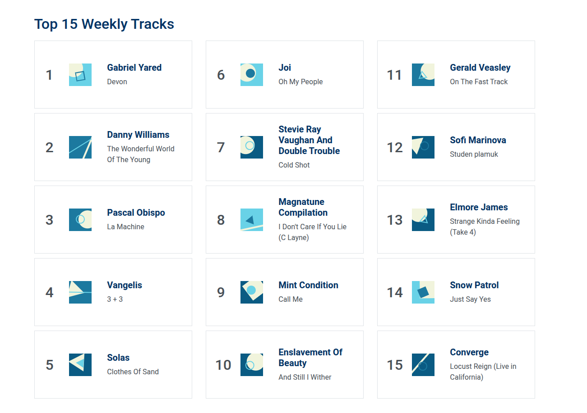
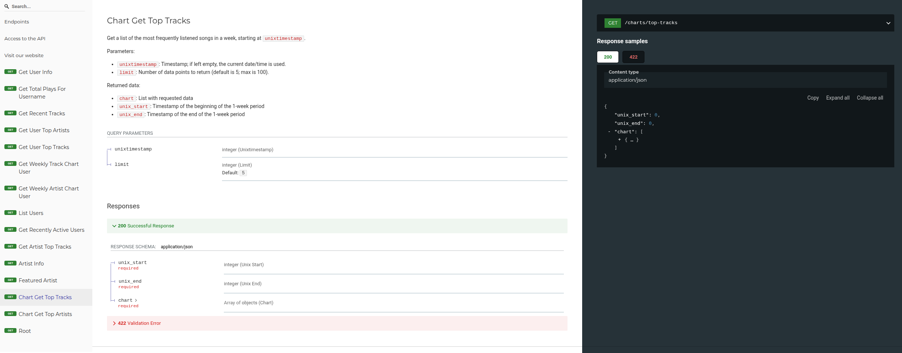
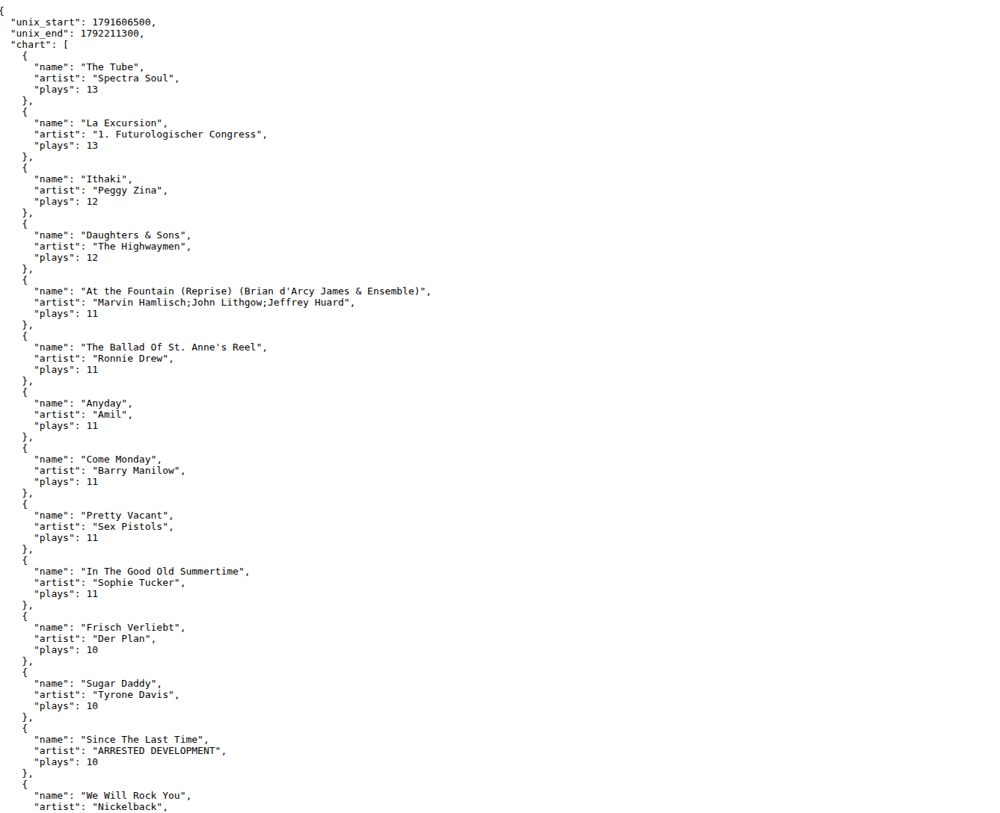

::: callout-tip
## Learning Goals {.unnumbered}

By the end of this lecture, you should be able to:

- Explain how an API differs from accessing data through a webpage.
- Construct and send an API request in R using `httr2`.
- Extract structured data from an API response and convert it into a dataframe.
- Create a reusable function that retrieves data for different input values.
- Apply iteration with `for` loops, `map()`, `expand_grid()`, and `map2()` to collect and combine data across many requests.

:::

## The Business Challenge

Suppose we work for a record label and want to understand how songs and artists perform in the weekly charts. Looking at the chart for one week can tell us what is popular at that moment, but many questions about performance require a longer view. A song that appears for only one week may have experienced a brief burst of attention, while a song that appears repeatedly may have remained popular for much longer. Similarly, an artist may enter the chart once or appear repeatedly across different songs and different points in time. If we want to distinguish these patterns, we need to look beyond a single weekly chart.

The website **Music to Scrape**, [https://music-to-scrape.org/](https://music-to-scrape.org/), publishes a chart of its most popular tracks for each week. The page below, for example, shows the chart for one week. For each track, we can see information such as the song name, the artist, and the number of plays. If our question were simply *Which songs were popular this week?*, we could answer it by reading this page.


```{r}
#| label: fig-music-to-scrape-chart
#| fig-cap: "Music to Scrape Top 15 weekly chart."
#| echo: false
#| out-width: "85%"
#| fig-align: center


```

::: {.callout-warning collapse=TRUE}
### A note on Music to Scrape {.unnumbered}

**Music to Scrape is a mock platform created for teaching.** It is designed to behave like a real music-streaming service might, including providing weekly charts through a website and an API.

We use it here because it gives us a stable, reproducible environment for learning how APIs work. Real services such as Spotify can require authentication, change their API rules, restrict access to particular data, or introduce rate limits that would distract from the main ideas in this chapter.

The workflow we learn here is designed to transfer to real APIs: understand how a request is structured, send it from R, inspect the response, and repeat the process to build the data we need.
:::

**Our task is larger**. We want to study the weekly charts over **five years, from 2022 to 2026**. In particular, we want to know **which songs appeared in the charts for the most weeks** and **which artists accumulated the most chart appearances** over that period. Answering these questions requires us to collect the chart for every week in those five years—around 260 weekly charts—and combine the results into one dataset. The information we need already exists on Music to Scrape, but it is currently spread across many separate weekly views rather than stored in one data set.

One option would be to collect those data manually. We could open the page for Week 1 of 2022, copy the chart into a spreadsheet, move to Week 2, and continue until we reached the end of 2026. But this would mean performing essentially the same task hundreds of times. It would also be difficult to reproduce: if we later wanted to update the analysis, correct a mistake, or collect a different set of weeks, we would have to repeat much of that work. The problem is therefore not that the data are unavailable. The problem is finding a systematic way to retrieve them.

Music to Scrape provides another route through an **application programming interface**, or **API**. An API provides a way for one piece of software to communicate with another. In our case, rather than using the website as a person would—choosing a week, opening the corresponding page, and reading the chart—we can write R code that asks Music to Scrape for the chart for a particular week and year. The website and the API are therefore two interfaces to the same system: one is designed primarily for people to browse, while the other allows code to request data in a structured form.

An API will not automatically give us the five-year dataset we want. We still need to tell Music to Scrape what data to return, understand the response, and repeat the request for the weeks and years we need. We will therefore begin with the smallest version of the problem: requesting the chart for one week. Once we can do that, we can turn the request into a reusable piece of code and scale from one weekly chart to the full five-year dataset.

### Libraries we need for our task {.unnumbered}

We will use two packages in this chapter.

```{r}
library(httr2)
library(tidyverse)
```

`tidyverse` gives us the familiar tools we will use to organise and analyse the data once it is in R.
`httr2` gives us the tools we need to build an API request, i.e. ask for data from a website, send it to another system, and work with the response that comes back. 
httr2 gives us the tools we need to build an API request: in other words, to tell another system what data we want, send that request over the web, and work with the response that comes back. It lets us specify things such as which part of an API we want to access and any details the API needs in order to answer our request. We will use `httr2` to request weekly chart data from Music to Scrape and bring the returned data into R.

## Accessing Data from the Web

When data are available online, there are two common ways that code can retrieve them: through an application programming interface, or API, and through web scraping. Both approaches can move data from the web into R, but they access those data in different ways. In this chapter, we will work with an API. Web scraping is another useful approach, but it is outside the scope of this subject.

An API is a way for a website provider to make data available directly to other programs. Instead of opening a webpage and reading the information displayed there, our code can ask for a particular set of data. The API then returns that information in a structured format that another program can work with, such as JSON. For Music to Scrape, this means that we can ask for the chart for a particular week and year and receive the corresponding chart data directly in R.

Web scraping takes a different route. When we visit a website in a browser, the page combines the information we care about with everything needed to display it, such as headings, links, buttons, tables, and other page elements. A web scraper downloads that webpage and then identifies and extracts the values we want from it. This approach can be useful when information is visible on a website but there is no suitable API that provides direct access to the data.

The difference is therefore about how our code gets the data. With web scraping, our code works with the same webpage that a person would view and extracts values from that page. With an API, the website provider has created a separate interface for code to request data. Rather than returning a webpage designed for display, the API returns structured information, often as JSON, that our code can process directly.

## Building an API Request

Our next task is to learn how to ask an API for one specific chart. We will start with requesting the musci chart for a given week, Week 42 of 2023. 
Once we can retrieve one weekly chart, we can use the same structure later when we build our five-year dataset.

### Start with the documentation {.unnumbered}

We do not need to guess how to ask an API for data. APIs normally come with documentation that describes the data we can request and the information we need to provide. For Music to Scrape, we can start with the [API documentation](https://api.music-to-scrape.org/docs).

When we open the documentation, we can see that the API provides several endpoints. An endpoint corresponds to a particular type of information or task that the API makes available. Because we want the weekly chart, we are interested in the endpoint for top tracks.

```{r}
#| label: fig-music-to-scrape-docs
#| fig-cap: "The Music to Scrape API documentation, the top-tracks endpoint"
#| echo: false
#| out-width: "90%"
#| fig-align: center


```

The documentation tells us how this endpoint is organised. It gives us the path used to request the top-tracks data and shows the parameters that we can supply with the request. For oour task, the important parameters are relate to the dates we are interested in, `year` and `week`, and the number of tracks we want returned, `limit`. 

::: {.callout-note}
### The documentation is the source of truth {.unnumbered}

Different APIs organise their requests in different ways. Parameter names such as `week` and `year` are not universal API commands: they are the names chosen by Music to Scrape. When working with another API, we would read that API's documentation to learn which endpoints and parameters it provides.
:::

### From the documentation to a URL {.unnumbered}

Suppose we want the top 100 tracks from Week 42 of 2023. Following the structure in the documentation gives us the following URL:

```text
https://api.music-to-scrape.org/charts/top-tracks?week=42&year=2023&limit=100
```

There are three parts of this URL that matter for us:

| Part | In our request | What it does |
|---|---|---|
| Base URL | `https://api.music-to-scrape.org` | Identifies the API we are sending the request to. |
| Endpoint | `/charts/top-tracks` | Identifies the type of data we want. |
| Parameters | `week=42&year=2023&limit=100` | Provide the details of this particular request. |

The base URL stays the same as we move around this API. The endpoint tells Music to Scrape that we want top-track chart data. The parameters then narrow that request: we want Week 42, from 2023, with up to 100 tracks returned.

You may have noticed two pieces of punctuation in the URL. The `?` marks the beginning of the query parameters, while `&` separates one parameter from the next. 

### See what the API returns {.unnumbered}

Before writing any R code, we can paste the URL directly into a web browser:

```text
https://api.music-to-scrape.org/charts/top-tracks?week=42&year=2023&limit=100
```

This time we do not see a webpage like the chart page we saw above. Instead, the browser displays structured data returned by the API. Music to Scrape returns its response as JSON, a format we have already encountered.


```{r}
#| label: fig-music-to-scrape-api-response
#| fig-cap: "JSON returned by the Music to Scrape API for Week 42 of 2023."
#| echo: false
#| out-width: "150%"
#| fig-align: center


```

This is useful for checking our understanding of the documentation. We asked for one weekly chart and received structured information about that chart. But copying API URLs into a browser does not solve our original problem: we eventually want R to make these requests for many different weeks and years. We therefore need to construct the same request in R.

### Build the request in R {.unnumbered}

The `httr2` package lets us construct an API request one piece at a time. We begin with the base URL:

```{r}
request("https://api.music-to-scrape.org")
```

`request()` creates a request object. At this point, R knows which API we intend to contact, but we have not yet told it which data we want.

We can add the endpoint with `req_url_path_append()`:

```{r}
request("https://api.music-to-scrape.org") |>
  req_url_path_append(
    "charts",
    "top-tracks"
  )
```

This adds `/charts/top-tracks` to the base URL. Notice that we provide each part of the path separately. `httr2` takes care of placing the `/` characters in the right locations.

Next, we add the parameters that describe the weekly chart we want:

```{r}
request("https://api.music-to-scrape.org") |>
  req_url_path_append(
    "charts",
    "top-tracks"
  ) |>
  req_url_query(
    week = 42,
    year = 2023,
    limit = 100
  )
```

`req_url_query()` adds the query parameters to the request. The names and values match what we learned from the documentation: `week = 42`, `year = 2023`, and `limit = 100`. `httr2` converts these into the `?week=42&year=2023&limit=100` part of the URL for us.

At this stage, we have described the request we want to make, but we have still not contacted Music to Scrape. This separation is useful: we can build and inspect a request before deciding to send it.

::: {.callout-important}
### Building a request is not the same as sending it {.unnumbered}

The functions `request()`, `req_url_path_append()`, and `req_url_query()` describe the request. They do not retrieve any data.

The request is sent only when we call `req_perform()`.
:::

### Send the request {.unnumbered}

We can now send the completed request with `req_perform()` and save the result:

```{r}
response <-
  request("https://api.music-to-scrape.org") |>
  req_url_path_append(
    "charts",
    "top-tracks"
  ) |>
  req_url_query(
    week = 42,
    year = 2023,
    limit = 100
  ) |>
  req_perform()
```

The object called `response` contains what Music to Scrape sent back after receiving our request. We can inspect it:

```{r}
response
```

The important distinction is between the request and the response. The request describes what we are asking Music to Scrape for. `req_perform()` sends that request, and Music to Scrape sends a response back to R.

## From API response to Rectangular Data

We have sent our first request to Music to Scrape and saved what came back as `response`. Before we turn those results into a dataframe, it is useful to understand what an API sends back and how R stores it.

An API response contains more than the data we asked for. It also contains information about the exchange itself, including whether the request succeeded and what kind of content was returned. The chart data we ultimately want are stored in the response body, but we can begin by inspecting the response as a whole:

```{r}
response
```

Among the information printed by `httr2` is a three-digit status code. A status code is the server's short way of reporting what happened when it received our request. For this request, the status is `200`, which tells us that Music to Scrape successfully processed the request and returned a response.

::: {.callout-note}
### Reading status codes {.unnumbered}

You do not need to memorise a long list of HTTP status codes. It is more useful to recognise the broad pattern:

- codes in the `200`s indicate that the request succeeded;
- codes in the `400`s indicate a problem with the request, such as asking for something that does not exist or supplying information the API cannot accept;
- codes in the `500`s indicate that something went wrong on the server receiving the request.

If an API request does not behave as expected, the status code is often one of the first things worth checking.
:::

A successful status code tells us that the exchange worked, but it is not the chart data themselves. Those data are stored in the response body. Music to Scrape returns that body as JSON, so we can use `resp_body_json()` to convert it into R objects:

```{r}
tracks_raw <-
  response |>
  resp_body_json()
```

We have worked with JSON in an earlier chapter. JSON can contain several pieces of information nested inside one another. We should first inspect its structure.

A simple place to start is with the names of the top-level components:

```{r}
names(tracks_raw)
```

For this response, the weekly chart is stored in the `chart` component. We can inspect that part directly:

```{r}
head(tracks_raw$chart, 5)
```

This is the part of the response that contains the individual tracks we asked for. Each track includes information such as its name, artist, and number of plays. The API has therefore returned the observations we need, but they are still stored as R objects created from the JSON response rather than as the dataframe we normally use for analysis.

We can turn those track records into a dataframe with `bind_rows()` and then keep the variables we need:

```{r}
tracks <-
  tracks_raw$chart |>
  bind_rows() |>
  select(
    name,
    artist,
    plays
  )
```

Now we can inspect the result:

```{r}
head(tracks)
```

At this point, the API-specific part of this request is finished. We started with an `httr2` response, extracted its JSON body, identified the part containing the chart, and turned those records into a dataframe. From here, `tracks` is an ordinary R dataframe that we can manipulate with the same tidyverse tools we have used throughout the subject.

This dataframe contains only one weekly chart, while our we want charts from 2022 through 2026. The next step is to package the request into a function so that the week and year can change while the rest of the workflow stays the same.

## Making the Request Reusable

Suppose we want to move from Week 42 of 2023 to Week 43 of 2023. The base URL, endpoint, and `limit = 100` all stay the same; only `week` changes. If we later move to another year, then `year` changes as well.

A function gives us a way to name a set of instructions that we want to reuse while allowing those inputs to change. Before writing one, it helps to be clear about what should go in and what should come out.

For this task, we want to give the function two pieces of information: a week and a year. In return, we want one tidy dataframe containing that weekly chart. Each row should represent one track, with columns for the track name, artist, number of plays, week, and year.

```text
week + year -> one weekly chart dataframe
```

So if we run `get_top_tracks(week = 42, year = 2023)`, we want the function to return the Week 42, 2023 chart. If we run `get_top_tracks(week = 43, year = 2023)`, we want the same steps to run again for Week 43.

### Decide what belongs inside the function {.unnumbered}

The easiest way to build the function is to start from code that already works and ask two questions:

1. Which parts stay the same every time?
2. Which parts need to change?

For our request, the base URL stays the same, the endpoint stays the same, and `limit = 100` stays the same. We also want to extract the `chart` component, combine the track records, and keep the same variables each time. In other words, most of the code from the previous section can be reused exactly as it is.

The parts that need to change are the values we previously wrote directly into `week = 42` and `year = 2023`. Instead of fixing those values in the code, we replace them with the input names `week` and `year`. That is the main change that turns our one-off workflow into a reusable function.

### Build the function {.unnumbered}

We can now package the workflow into a function called `get_top_tracks()`:

```{r}
get_top_tracks <- function(week, year) {

  tracks_raw <-
    request("https://api.music-to-scrape.org") |>
    req_url_path_append(
      "charts",
      "top-tracks"
    ) |>
    req_url_query(
      week = week,
      year = year,
      limit = 100
    ) |>
    req_perform() |>
    resp_body_json()

  tracks_raw$chart |>
    bind_rows() |>
    select(
      name,
      artist,
      plays
    ) |>
    mutate(
      week = week,
      year = year
    )
}
```

The first line is worth reading slowly: {.unnumbered}

```r
get_top_tracks <- function(week, year) {
```

`get_top_tracks` is the name we are giving the function. The names inside `function()` are the inputs that can change. Everything inside `{}` is the set of instructions that R will run when we call the function.

For example, when we run:

```r
get_top_tracks(
  week = 42,
  year = 2023
)
```

R uses `42` wherever `week` appears inside the function and `2023` wherever `year` appears. Naming the arguments makes that mapping explicit. The rest of the code runs exactly as written.

The last part of the function creates the dataframe we want to keep. Because that is the final expression inside the function, that dataframe is what `get_top_tracks()` returns to us. The result has one row per track and keeps the variables we need for the later analysis.

The final `mutate()` also records which weekly chart each row came from:

```r
mutate(
  week = week,
  year = year
)
```

Here the same names appear on both sides of `=` but they are doing different jobs. The names on the left, `week` and `year`, are the new columns we are creating. The names on the right refer to the values supplied to the function. If we call `get_top_tracks(week = 42, year = 2023)`, every returned row will therefore record `week = 42` and `year = 2023`. That information will matter once we combine many weekly charts.

### Use the function for different weeks {.unnumbered}

Once the function is defined, retrieving a weekly chart becomes much simpler:

```{r}
get_top_tracks(
  week = 42,
  year = 2023
)
```

To request the following week, we only change the first input:

```{r}
get_top_tracks(
  week = 43,
  year = 2023
)
```

And then again for Week 44:

```{r}
get_top_tracks(
  week = 44,
  year = 2023
)
```

These three calls all run the same workflow: build the request, send it, extract the JSON response, turn the chart into a dataframe, and record the week and year. We only change the input values.

::: {.callout-note}
### Functions need the inputs they were defined to use {.unnumbered}

We defined `get_top_tracks()` with two inputs: `week` and `year`. If we run:

```{r}
#| eval: FALSE 
get_top_tracks(
  week = 20
)
```

R does not know which year we want and will return an error. Supplying both inputs makes the request unambiguous:

```{r}
get_top_tracks(
  week = 20,
  year = 2023
)
```
:::

### From reuse to repetition {.unnumbered}

For three weeks, calling the function manually is easy enough. But our goal is not to collect three weekly charts. Even if we considered only one year, we would need to retrieve the chart for every week:

```{r}
get_top_tracks(
  week = 1,
  year = 2023
)
get_top_tracks(
  week = 2,
  year = 2023
)
get_top_tracks(
  week = 3,
  year = 2023
)
# ...
get_top_tracks(
  week = 52,
  year = 2023
)
```

Writing 52 separate function calls would work, but it would be repetitive. In the next section, we will look at two ways to express that repeated work.

## Repeating a Task with Iteration

What we want R to do is: take the same function and repeat it for every week from 1 to 52. This idea is called iteration. Iteration means performing the same task repeatedly while changing one or more inputs each time. There are two ways we could write code to get R to iteratively get the top charts for us. We explore each below.

### A `for` loop {.unnumbered}

A `for` loop is one way to write an iterative task in R. We first create the collection of values we want to work through:

```{r}
weeks_to_collect <- 1:52
```

`weeks_to_collect` now contains the numbers 1 through 52. These are the values we want R to use, one at a time, as the `week` input to `get_top_tracks()`.

The basic structure of our loop is:

```{r}
for (iWeek in weeks_to_collect) {
  # code to repeat
}
```

There are two different roles here, and keeping them separate makes the loop easier to read. `weeks_to_collect` is the full set of weeks we want. `iWeek` is the iterator: the temporary value R is working with right now.

Think of R moving through `weeks_to_collect` from left to right. On the first pass, `iWeek = 1`, so the code inside `{}` runs for Week 1. Then `iWeek = 2`, so the same code runs for Week 2. R keeps going in this way until it reaches Week 52.

Before we involve the API, we can make that process visible:

```{r}
for (iWeek in weeks_to_collect) {
  print(iWeek)
}
```

This loop does not collect any chart data. Its only job is to show us what is being passed through the iterator. On each pass, R assigns the current value from `weeks_to_collect` to `iWeek`, then `print(iWeek)` displays that value.

We can now use the same iterator as the input to our function:

```{r}
#| cache: true

for (iWeek in weeks_to_collect) {
  get_top_tracks(
    week = iWeek,
    year = 2023
  )
}
```

`get_top_tracks()` still retrieves one weekly chart. The loop's job is simply to change the value supplied to `week` and run that function again.

There is one more problem to solve. We do not only want R to run the 52 requests; we also want to keep the 52 dataframes that come back. At this stage, those results are still separate dataframes, so we need an object that can hold them together before we combine them later. A list is useful for this because each element of a list can store one dataframe.

```{r}
#| cache: true

weeks_to_collect <- 1:52
results <- list()

for (iWeek in weeks_to_collect) {
  results[[iWeek]] <-
    get_top_tracks(
      week = iWeek,
      year = 2023
    )
}
```

Before the loop starts, `results <- list()` creates an empty list. Each time the loop runs, the dataframe returned by `get_top_tracks()` is placed into that list. The expression `results[[iWeek]]` tells R which position to use. When `iWeek = 42`, for example, the Week 42 dataframe is stored in position 42.

After the loop finishes, `results` contains one dataframe for each week we collected. We can inspect one of those weekly dataframes directly:

```{r}
results[[42]]
```

This gives us the Week 42 chart. The loop has therefore done the same work we would otherwise have written manually 52 times.

For analysis, however, we usually want one dataframe rather than a list of separate weekly dataframes. We can combine them with `list_rbind()`:

```{r}
tracks_2023 <-
  results |>
  list_rbind()

head(tracks_2023)
```

`list_rbind()` stacks the weekly dataframes on top of one another. Because `get_top_tracks()` already added `week` and `year`, those columns tell us which weekly chart each row came from after everything has been combined.

### The same task with `map()` {.unnumbered}

A `for` loop is useful because we can see every part of the process: take one value, run the code, save the result, then move to the next value. However, we can write the same job more compactly with `map()`.

We can write the same workflow described above more compactly as:

```{r}
#| cache: true
tracks_2023 <-
  map(
    weeks_to_collect,
    get_top_tracks,
    year = 2023
  ) |>
  list_rbind()

head(tracks_2023)
```

Here, `weeks_to_collect` again supplies the weeks we want to work through. `get_top_tracks` is the function we want to run for each one. The year does not change, so we give `map()` `year = 2023` once and keep it fixed across all 52 calls.

There is one important detail to understand here: which input to `get_top_tracks()` is changing? Recall how we defined the function:

```r
get_top_tracks <- function(week, year) {
```

The changing values come from `weeks_to_collect`. In this call to `map()`, those values are used for `week`, while `year = 2023` is supplied separately and stays fixed.

So this:

```r
map(
  weeks_to_collect,
  get_top_tracks,
  year = 2023
)
```

is doing the same kind of work as writing:

```r
get_top_tracks(
  week = 1,
  year = 2023
)

get_top_tracks(
  week = 2,
  year = 2023
)

get_top_tracks(
  week = 3,
  year = 2023
)

# ...and so on through Week 52
```


::: {.callout-note}
### Which argument changes? {.unnumbered}

A useful rule to remember is that the values in the first input to `map()` are passed to the first argument of the function you are mapping. Named arguments that follow, such as `year = 2023`, stay fixed.

Because `get_top_tracks()` was defined as `function(week, year)`, the changing values go into `week`.
:::

Each returned dataframe is collected into a list, and `list_rbind()` immediately stacks those results into the single dataframe `tracks_2023`.

The `for` loop spells out the repeated steps, the storage of results, and the final combination. `map()` expresses the same workflow more compactly. Both are doing the same underlying job: applying one function repeatedly across a collection of input values.


## Varying More Than One Input

So far, our iterative workflow has changed one input at a time. We used `weeks_to_collect` to vary `week`, while keeping `year = 2023` fixed. That was enough to collect one full year of weekly charts.
But, we want charts from several years, so both `week` and `year` need to change. 

Suppose we want Weeks 42, 43, and 44 from both 2023 and 2024. The requests we need are:

```text
Week 42, 2023
Week 42, 2024
Week 43, 2023
Week 43, 2024
Week 44, 2023
Week 44, 2024
```

We could write those six combinations by hand, but R can construct them for us.

### Build the combinations with `expand_grid()`  {.unnumbered}

The function `expand_grid()` creates every combination of the values we give it. We can use it to create the week-year combinations we want:

```{r}
week_years <-
  expand_grid(
    week = 42:44,
    year = 2023:2024
  )
```

If we inspect `week_years`, we get a small dataframe with two columns:

```{r}
week_years
```

Each row represents one combination of `week` and `year`. In this example, there are three possible weeks and two possible years, so `expand_grid()` creates six rows in total. Because we listed `week` first, the weeks change more slowly while the years change within each week.

The first row represents Week 42 of 2023, the second Week 42 of 2024, the third Week 43 of 2023, and so on. In other words, `week_years` is now a dataframe that describes the requests we want to make.

### Use `map2()` when two inputs change  {.unnumbered}

`expand_grid()` has solved the first problem: it has created the week-year pairs we want. We now need to run `get_top_tracks()` once for each of those pairs.

With `map()`, we supplied one collection of changing values because only `week` was changing. Here, both `week` and `year` change together, so we need a tool that can move through two collections at the same time. That is what `map2()` does:

```{r}
#| cache: true
results <-
  map2(
    week_years$week,
    week_years$year,
    get_top_tracks
  )
```

`map2()` works through two vectors in parallel. It takes the first week and the first year and uses them together in one function call. Then it takes the second week and the second year, then the third pair, and so on.

Recall that our function was defined as:

```r
get_top_tracks <- function(week, year) {
```

That ordering matters. The first vector supplied to `map2()`, `week_years$week`, feeds the `week` argument. The second vector, `week_years$year`, feeds the `year` argument.

We can think of the first few calls as:

```r
get_top_tracks(
  week = 42,
  year = 2023
)

get_top_tracks(
  week = 42,
  year = 2024
)

get_top_tracks(
  week = 43,
  year = 2023
)

# ...and so on
```

`map2()` performs those calls for us and stores each returned dataframe in a list called `results`.

A useful way to read the code is:

> Move through `week_years$week` and `week_years$year` together, and run `get_top_tracks()` once for each matching pair of values.

### Combine the results  {.unnumbered}

Just as before, the result of `map2()` is a list containing one dataframe for each function call. We can combine those dataframes with `list_rbind()`:

```{r}
tracks <-
  results |>
  list_rbind()

glimpse(tracks)
```

We now have one dataframe containing all six weekly charts in our small example. Because `get_top_tracks()` already adds `week` and `year`, every row still records which weekly chart it came from.

### Scale up the same workflow {.unnumbered}

Once the small example is clear, scaling up does not require a new idea. We only change the values supplied to `expand_grid()`:

```{r}
week_years <-
  expand_grid(
    week = 1:52,
    year = 2022:2026
  )
```

This creates every combination of 52 weeks and five years, giving us the full set of week-year requests.

We can then use exactly the same `map2()` workflow:

```{r}
#| cache: true

tracks <-
  map2(
    week_years$week,
    week_years$year,
    get_top_tracks
  ) |>
  list_rbind()

glimpse(tracks)
```

## Conclusion

We began with a simple problem: Music to Scrape showed us one weekly chart at a time, but our business question required data across many weeks and years. The challenge was not finding one chart. It was building a systematic way to collect the same type of data repeatedly.

We solved that problem in stages. We used the API documentation to work out how to request one weekly chart, then used `httr2` to build and send that request from R. From the response, we extracted the JSON body and turned the chart data into a dataframe.

Once one request worked, we made the workflow reusable by wrapping it inside `get_top_tracks()`, with `week` and `year` as inputs. We then used iteration to repeat that same task across many weeks, first with a `for` loop and then with `map()`. Finally, when both `week` and `year` needed to vary, we used `expand_grid()` and `map2()` to scale the same logic across the full set of requests.
The result is one dataframe containing weekly chart data from 2022 to 2026.

The broader lesson extends beyond music charts. Many APIs make data available one request at a time. Once we understand how to make one request correctly, functions and iteration let us turn that single request into a reproducible workflow for collecting many related observations.
